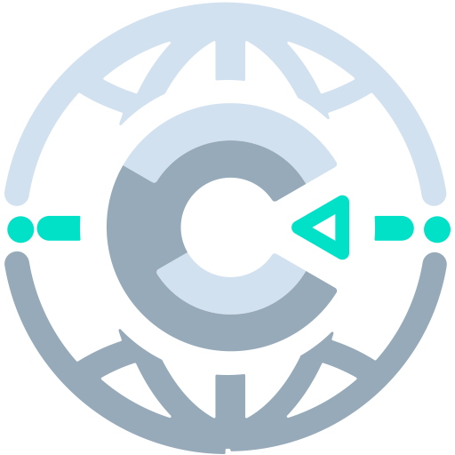

<br>
# Global Runtime
<i>Makes the SDK runtime global</i> <br>
### Version 2.0.0.2

[](https://github.com/skymen/globalRuntime_sdkv2/releases/download/skymen_GlobalRuntime-2.0.0.2.c3addon/skymen_GlobalRuntime-2.0.0.2.c3addon)
<br>
<sub> [See all releases](https://github.com/skymen/globalRuntime_sdkv2/releases) </sub> <br>

#### What's New in 2.0.0.2
- **Changed:** Removed save game handling and published-name bookkeeping. A single global plugin only ever publishes one name and save states do not need it.

<sub>[View full changelog](#changelog)</sub>

---
<b><u>Author:</u></b> skymen <br>
<b>[Documentation](https://github.com/skymen/globalRuntime_sdkv2)</b>  <br>
<sub>Made using [CAW](https://marketplace.visualstudio.com/items?itemName=skymen.caw) </sub><br>

## Table of Contents
- [Usage](#usage)
- [Examples Files](#examples-files)
- [Properties](#properties)
- [Actions](#actions)
- [Conditions](#conditions)
- [Expressions](#expressions)
---
## Usage
To build the addon, run the following commands:

```
npm i
npm run build
```

To run the dev server, run

```
npm i
npm run dev
```

## Examples Files

---
## Properties
| Property Name | Description | Type |
| --- | --- | --- |
| Global Runtime Name | The name to use to expose the runtime with | text |


---
## Actions
| Action | Description | Params
| --- | --- | --- |


---
## Conditions
| Condition | Description | Params
| --- | --- | --- |


---
## Expressions
| Expression | Description | Return Type | Params
| --- | --- | --- | --- |


---
## Changelog

**2.0.0.2**
- **Changed:** Removed save game handling and published-name bookkeeping. A single global plugin only ever publishes one name and save states do not need it.

**2.0.0.1**
- **Changed:** The capture hack now patches only the built-in Sprite plugin instead of every registered plugin and behavior class. Warns in the console if the project has no Sprite object.

**2.0.0.0**
- **Added:** SDK v2 port. Same id and property as the v1 addon.
- **Changed:** SDK v2 has no path to the internal runtime, so this addon now captures it by subclassing every built-in plugin and behavior instance class. The global is published as a lazy getter: it exists immediately and resolves to the runtime once the first built-in instance is created. In a project with no built-in objects at all it stays null.
